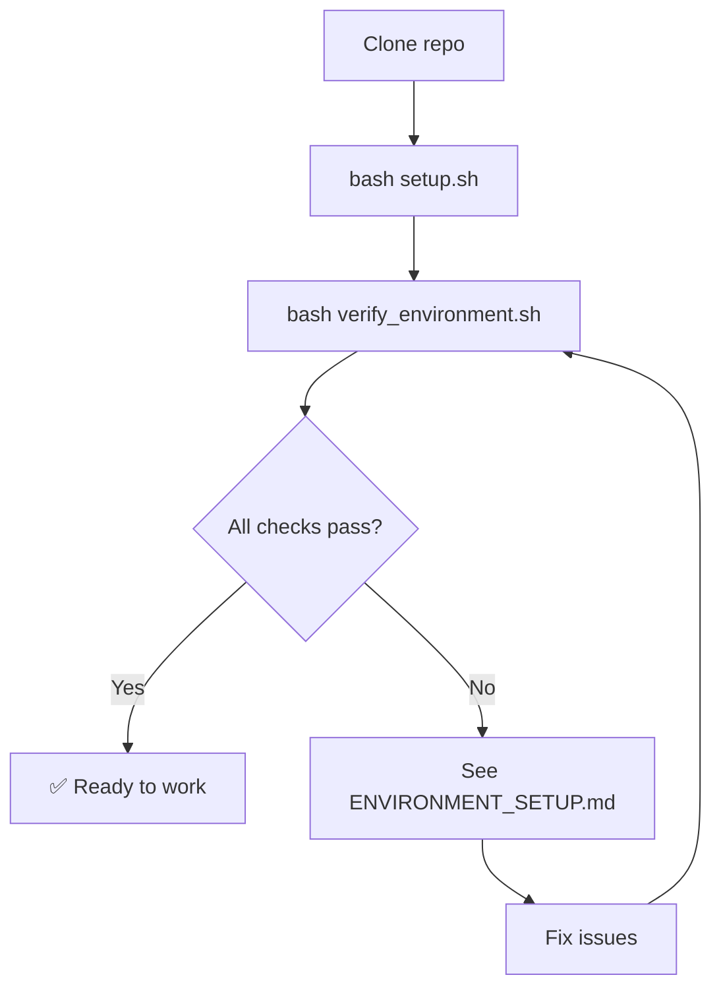

# Environment Setup Files Guide

**Purpose**: Understand what each environment file does

---

## 📁 File Overview

| File | Type | Purpose | When to Use |
|------|------|---------|-------------|
| **setup.sh** | Script | Automated setup | First time (30-60 min) |
| **verify_environment.sh** | Script | Check installation | After setup, anytime |
| **setup_r_environment.R** | Script | R package setup | If setup.sh fails for R |
| **ENVIRONMENT_QUICK_START.md** | Doc | Quick reference | Quick lookup |
| **ENVIRONMENT_SETUP.md** | Doc | Complete guide | Detailed instructions |
| **pyproject.toml** | Config | Python dependencies | Auto-managed by uv |
| **renv.lock** | Config | R dependencies | Auto-managed by renv |

---

## 🚀 Quick Setup Flow



---

## 📜 Scripts Detail

### `setup.sh`

**What it does**:
1. Detects platform (macOS/Linux/Windows)
2. Checks Python 3.12+
3. Installs `uv` if missing
4. Creates Python virtual environment
5. Installs Python packages
6. Checks R 4.3+
7. Installs R packages via `renv`

**Run when**:
- First time setup
- After major system changes
- After corrupted environment

**Example**:
```bash
bash setup.sh
```

**Expected time**: 30-60 minutes

---

### `verify_environment.sh`

**What it does**:
1. Checks all system tools (Python, uv, R, Git, JAGS, Quarto)
2. Verifies Python packages
3. Verifies R packages
4. Checks JAGS-rjags connection
5. Validates project structure
6. Shows summary report

**Run when**:
- After setup
- Before starting new project
- Debugging environment issues
- After package updates

**Example**:
```bash
bash verify_environment.sh
```

**Expected time**: 2 minutes

**Sample output**:
```
✅ python3 - Python 3.12.1
✅ uv - uv 0.5.24
✅ R - R version 4.3.2
✅ pandas - 3.0.0
✅ meta - 8.2.1
✅ ENVIRONMENT READY FOR META-ANALYSIS
```

---

### `setup_r_environment.R`

**What it does**:
1. Installs `renv` package
2. Initializes `renv` project
3. Installs core meta-analysis packages
4. Creates `renv.lock` snapshot

**Run when**:
- `setup.sh` failed for R packages
- Manual R setup needed
- Resetting R environment

**Example**:
```bash
Rscript setup_r_environment.R
```

**Expected time**: 10-20 minutes

---

## 📄 Documentation Files

### `ENVIRONMENT_QUICK_START.md`

**For**: Quick lookup, experienced users
**Contains**:
- 3-minute setup commands
- Package lists
- Common troubleshooting
- Quick fixes

**Use when**: Need fast reference

---

### `ENVIRONMENT_SETUP.md`

**For**: First-time users, detailed guidance
**Contains**:
- Step-by-step setup (30-60 min)
- Platform-specific instructions
- Dependency lists
- Full troubleshooting guide
- renv workflow
- Maintenance instructions

**Use when**: First setup or major issues

---

## 🔧 Configuration Files

### `tooling/python/pyproject.toml`

**What it is**: Python dependency specification

**Format**:
```toml
[project]
requires-python = ">=3.12"
dependencies = [
    "bibtexparser>=1.4.4",
    "pandas>=3.0.0",
    # ...
]
```

**Managed by**: `uv`

**Edit when**: Adding new Python package
```bash
cd tooling/python
uv add <package-name>
```

---

### `renv.lock`

**What it is**: R package version snapshot

**Format**: JSON with exact package versions

**Managed by**: `renv`

**Edit when**: Adding new R package
```r
install.packages("new_package")
renv::snapshot()
```

**Restore**:
```r
renv::restore()  # Install exact versions
```

---

## 🔄 Common Workflows

### First Time Setup

```bash
# 1. Run automated setup
bash setup.sh

# 2. Verify
bash verify_environment.sh

# 3. If issues, see detailed guide
cat ENVIRONMENT_SETUP.md
```

---

### After Git Clone (New Machine)

```bash
# 1. Restore Python environment
cd tooling/python
uv sync

# 2. Restore R environment
R
# In R:
renv::restore()
quit()

# 3. Verify
bash verify_environment.sh
```

---

### Adding New Python Package

```bash
cd tooling/python
uv add <package-name>
git add pyproject.toml
git commit -m "Add <package> for <purpose>"
```

---

### Adding New R Package

```r
# In R console
install.packages("new_package")
renv::snapshot()  # Update renv.lock

# In bash
git add renv.lock
git commit -m "Add new_package for <purpose>"
```

---

### Fixing Broken Environment

**Python**:
```bash
cd tooling/python
rm -rf .venv
uv venv
uv sync
```

**R**:
```r
renv::purge()    # Clear cache
renv::restore()  # Reinstall from lock
```

---

### Updating All Packages

**Python**:
```bash
cd tooling/python
uv sync --upgrade
```

**R**:
```r
renv::update()
renv::snapshot()
```

---

## 🎯 Decision Tree: Which File to Use?

```
Need environment setup?
├─ First time? → bash setup.sh
├─ Check status? → bash verify_environment.sh
├─ Quick reference? → ENVIRONMENT_QUICK_START.md
├─ Detailed guide? → ENVIRONMENT_SETUP.md
├─ R setup only? → Rscript setup_r_environment.R
└─ Add package?
   ├─ Python → uv add <pkg>
   └─ R → install.packages() + renv::snapshot()
```

---

## 🆘 Troubleshooting Map

| Problem | File to Check | Solution |
|---------|---------------|----------|
| Setup fails | `setup.sh` output | See ENVIRONMENT_SETUP.md troubleshooting |
| Package missing | `verify_environment.sh` | Re-run `uv sync` or `renv::restore()` |
| Python error | `pyproject.toml` | Check dependencies list |
| R package error | `renv.lock` | Run `renv::restore()` |
| uv not found | Terminal PATH | See ENVIRONMENT_SETUP.md "uv installation" |
| JAGS error | System install | `brew install jags` (macOS) |

---

## 📊 File Dependency Graph

```
ENVIRONMENT_SETUP.md (master guide)
    ↓
    ├── setup.sh (automated)
    │   ├── pyproject.toml (Python deps)
    │   └── setup_r_environment.R → renv.lock (R deps)
    │
    ├── verify_environment.sh (validation)
    │
    └── ENVIRONMENT_QUICK_START.md (quick ref)
```

---

## 💡 Best Practices

1. **Always verify after setup**:
   ```bash
   bash verify_environment.sh
   ```

2. **Commit dependency changes**:
   ```bash
   git add pyproject.toml renv.lock
   git commit -m "Update dependencies"
   ```

3. **Document why you added a package**:
   ```bash
   git commit -m "Add gemtc for Bayesian NMA analysis"
   ```

4. **Test on clean environment**:
   - Use Docker or fresh VM
   - Run `setup.sh` from scratch
   - Ensures reproducibility

5. **Keep documentation updated**:
   - Update `ENVIRONMENT_SETUP.md` if you find issues
   - Document platform-specific quirks

---

## 🔗 Related Files

- [RESUME_QUICK_REFERENCE.md](../RESUME_QUICK_REFERENCE.md) - Session recovery
- [CLAUDE.md](../CLAUDE.md) - Main agent instructions
- [ma-search-bibliography/references/api-setup.md](../ma-search-bibliography/references/api-setup.md) - API keys

---

**Created**: 2026-02-17
**Maintainer**: Update when adding new scripts or dependencies
**Status**: ✅ Complete
